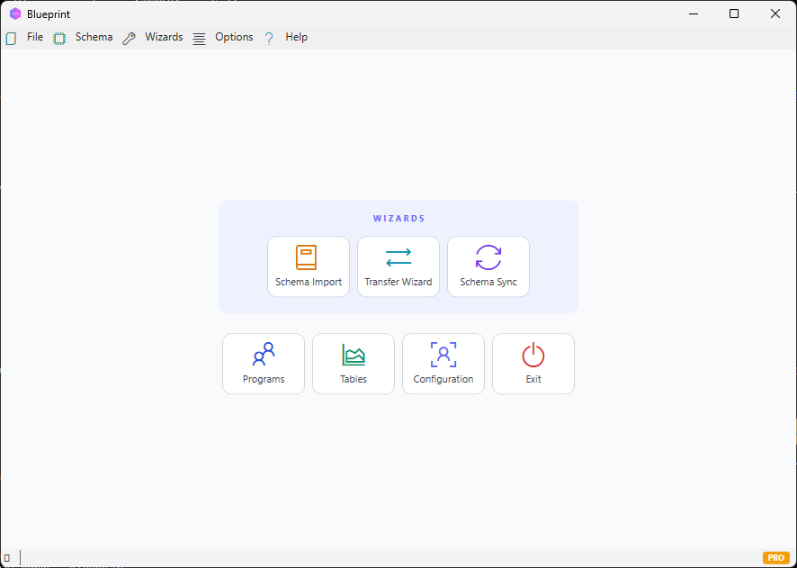

# BlueprintDB: Unified Database Management & Synchronization Engine

*X-ray your backend, blueprint your schema, and orchestrate seamless migrations.*

**BlueprintDB** is a professional database management application built in C#. It is engineered for software architects and DBAs who need a reliable, architectural approach to managing and synchronizing complex data environments.

Developed over two decades at **Pragma d.o.o.** to maintain ERP systems for 100+ corporate clients, this tool provides a field-tested solution for bridging the gap between legacy data and modern enterprise infrastructure.

---

## 💡 Why BlueprintDB?

Most database tools are designed for simple data entry. BlueprintDB is designed for **structural integrity and migration**.

- **X-Ray & Blueprint:** Deeply inspect any database backend, capture its full schema metadata, and store it as a portable blueprint — independent of the live database.
- **Legacy-to-Modern Bridging:** High-performance metadata and data transfer from legacy file-based systems (dBase, FoxPro, MS Access) to SQL Server, PostgreSQL, MySQL, and more.
- **Intelligent Driver Detection:** Automatically detects whether `Microsoft ACE OleDb` is installed via Windows Registry. Instead of a cryptic COM error, users receive a clear message with a direct download link for the 64-bit redistributable.
- **Offline Portability:** Create a schema blueprint in one environment and apply it to a remote backend — without requiring a direct live connection between servers.

---

## 🎬 System Overview in Action

*The workflow: Project selection → X-Ray Metadata Import → Structural Mapping → Live Schema Synchronization.*

---

## 🗄️ Multi-Engine Capabilities

BlueprintDB provides a unified abstraction layer for **10 different database engines**:

| Engine | Support |
| :--- | :--- |
| **SQL Server** | Full Schema & Data Sync, optimized DDL execution |
| **PostgreSQL** | Native synchronization and type mapping |
| **MySQL / MariaDB** | Schema extraction and migration |
| **MS Access** | Full 64-bit OleDb support with automated driver detection |
| **Firebird** | Advanced metadata inspection and sync |
| **Oracle** | Schema import and transfer |
| **IBM DB2** | Schema import and transfer |
| **SQLite** | Local management and metadata inspection |
| **dBase / FoxPro** | Structural extraction for modern migration |

---

## ⚙️ Technical Core: The Synchronization Engine

The C# core uses a multi-pass synchronization approach:

1. **Deep Metadata Inspection:** Captures table structures, column types, constraints, primary keys, and foreign key relationships directly from the live backend via its native driver.
2. **Canonical Type Mapping:** A dedicated mapping layer normalizes engine-specific types (e.g., Access `AutoNumber`, ADO `adWChar`, Oracle `NUMBER`) into a canonical representation, enabling accurate cross-engine DDL generation.
3. **Schema Diff & Apply:** Compares the stored blueprint against the live backend schema, identifies differences (missing tables, missing columns, missing FK constraints), and applies precise DDL statements — with full FK index management for backends like MS Access.
4. **Data Transfer:** Migrates row data between any two supported backends with type-aware conversion, handling edge cases such as OLE Automation dates, Access boolean (`-1`/`0`) encoding, and locale-safe decimal formatting.

---

## 🔓 Free vs Pro

| Feature | Free | Pro |
| :--- | :---: | :---: |
| SQLite & MS Access | ✅ | ✅ |
| Schema Import (X-Ray) | ✅ | ✅ |
| Schema Sync | ✅ | ✅ |
| Data Transfer (5 runs) | ✅ | ✅ |
| All 10 backends | — | ✅ |
| Unlimited Data Transfer | — | ✅ |

**Pro license — $49 one-time →** [blueprintdb.io](https://blueprintdb.io)

---

## 📥 Download

The latest installer (`BlueprintDB-Setup-vX.X.X-win-x64.exe`) is available on the [Releases](https://github.com/slavkomatanovic/BlueprintDB/releases) page.

Requires Windows 10/11 (64-bit). Self-contained — no .NET runtime installation needed.

---

## 👤 About the Author

**Slavko Matanović** is a software architect and the Director of **Pragma d.o.o.** (BiH), a software firm with 20+ years of experience maintaining ERP systems across 100+ corporate clients. He is a FIDE Candidate Master (MK) and currently serves as the **Ambassador of Bosnia and Herzegovina to Jordan**.

BlueprintDB is the result of two decades of pragmatic, field-tested software engineering.
